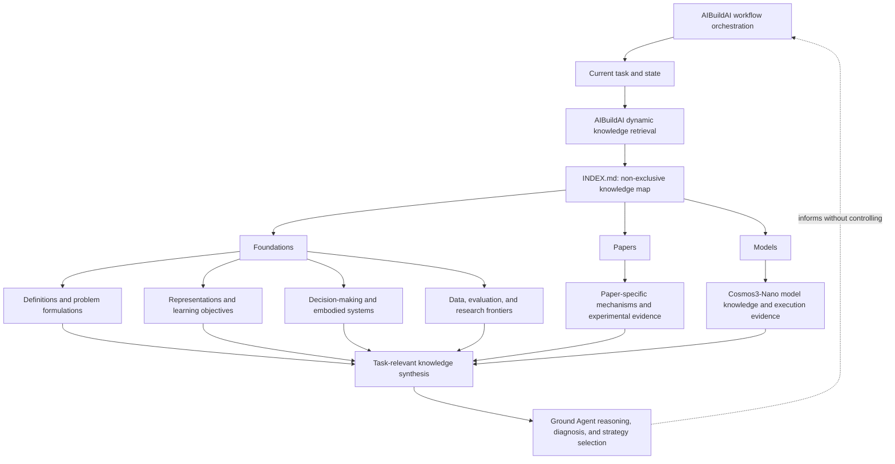

# World Model Knowledge Base

This repository is a structured knowledge and evidence layer for world-model research. It contains reusable World Model Foundations and an active NVIDIA Cosmos3-Nano model entry. The content connects general formalisms, representation and learning choices, model mechanisms, interfaces, evaluation conditions, source code, execution records, and candidate optimization experiments.

## Authority boundary

The KB is a knowledge-guidance layer. It is intended to shape Agent understanding, judgment, and strategy selection, while leaving workflow orchestration to AIBuildAI.

- AIBuildAI runtime instructions, Agent configuration, task instructions, permissions, and policies remain authoritative.
- The KB provides model facts, high-level knowledge instructions, strategies, best practices, diagnostic frameworks, and experiment-quality criteria.
- AIBuildAI may dynamically retrieve this knowledge to ground design and implementation decisions.
- Retrieval profiles support that dynamic loading but are not mandatory workflow routes.
- The KB does not decide which Agent to call, which solution repository to advance or abandon, task order, execution scheduling, permissions, approvals, or external actions.
- Scientific caveats describe what evidence supports a claim; they are not Agent-control rules.

## Architecture



The three content parts are peer, non-exclusive knowledge inputs. Retrieval can combine any relevant Foundation concepts, paper evidence, and model-specific facts; it does not have to enter through Cosmos3-Nano. Foundations and the Cosmos3-Nano entry are active. Papers remains a reserved part until paper-specific entries are added.

The repository separates five concerns:

1. **Discovery:** indexes describe which documents may be relevant.
2. **Canonical knowledge:** one page owns each reusable topic.
3. **Provenance:** source IDs resolve to pinned papers, code revisions, model revisions, or local artifacts.
4. **Execution evidence:** reproduction records distinguish documented capability from an observed run.
5. **Experiment design:** optimization references connect failures, mechanisms, variables, measurements, and confounders without scheduling work.

## Top-level structure

```text
world_model_kb/
|-- README.md                         # Repository guide
|-- INDEX.md                          # Global topic map
|-- CHANGELOG.md                      # Schema, path, and ownership history
|-- _schema/                          # Content and metadata contracts
|-- foundations/                      # Part I: model-independent knowledge
|-- papers/                           # Part II: paper-specific knowledge
|-- models/                           # Part III: model-specific knowledge
`-- tools/                            # Structural validation
```

The three content parts are peers:

| Part | Scope | Current content |
|---|---|---|
| [Foundations](foundations/README.md) | Model-independent concepts, formalisms, representations, objectives, control, embodiment, data, and evaluation | Active; eight semantic subparts |
| [Papers](papers/README.md) | Paper-specific mechanisms, implementations, experiments, and transfer hypotheses | Reserved; no paper entries yet |
| [Models](models/README.md) | Model-specific architecture, interfaces, learning, evaluation, code, and execution evidence | Cosmos3-Nano is active |

## How to navigate

Start from [`INDEX.md`](INDEX.md) for the global topic map. AIBuildAI may dynamically combine model-independent foundations, paper-specific evidence, and model-specific knowledge rather than assigning a task to exactly one part. The Foundation [`retrieval-index.yaml`](foundations/retrieval-index.yaml) and Cosmos3-Nano [`agent-index.yaml`](models/cosmos3-nano/agent-index.yaml) expose advisory query-to-knowledge associations without taking workflow authority.

Within a topic page, `Retrieval metadata` identifies related questions and pages. Stable source IDs resolve through the nearest owning source registry, such as Foundation [`sources.yaml`](foundations/sources.yaml) or Cosmos3-Nano [`sources.yaml`](models/cosmos3-nano/sources.yaml). Observed model execution evidence remains separate in [`reproduction.md`](models/cosmos3-nano/reproduction.md). The `_schema/` directory defines how KB content is represented; it does not define AIBuildAI workflow orchestration.

## Validation

[`tools/validate_kb.py`](tools/validate_kb.py) checks UTF-8 and English content, metadata, links, source references, artifact hashes, required files, and both knowledge-guidance retrieval indexes.

Run from the repository root:

```bash
python tools/validate_kb.py
```

## Important evidence distinctions

- A public checkpoint does not establish complete training reproducibility.
- A documented command does not establish that it ran successfully in a local environment.
- A hosted model ID does not reveal its deployed checkpoint SHA unless the service publishes it.
- A Reasoner text plan is not a robot action tensor.
- A realistic video is not automatically a physically correct future.
- A benchmark score is meaningful only with its checkpoint, task mode, protocol, evaluator, and inference budget.
- An unresolved hypothesis is not a model fact.

These statements define the scope of evidence in the KB. They do not constrain how AIBuildAI organizes or executes work.
