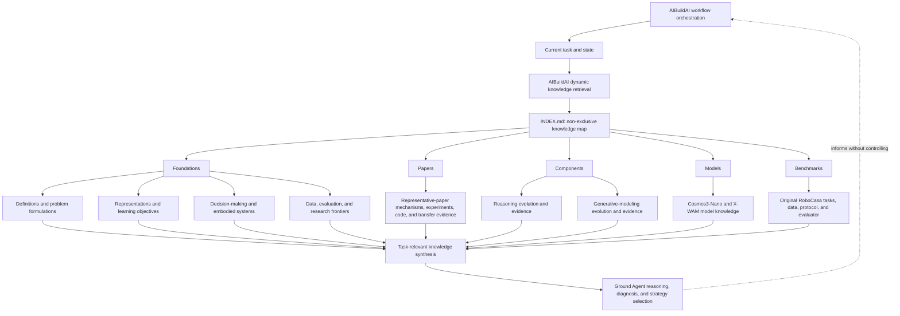

# World Model Knowledge Base

This repository is a structured knowledge and evidence layer for world-model research. It contains reusable World Model Foundations, fourteen representative-paper entries, independently scoped Components, two active Model entries, and a versioned Benchmark part. The current World Representation, Dynamics Modeling, Reasoning, and Generative Modeling Components use cross-paper synthesis to connect general formalisms, representation and learning choices, paper mechanisms and ablations, model interfaces, evaluation conditions, and candidate optimization experiments.

## Authority boundary

The KB is a knowledge-guidance layer. It is intended to shape Agent understanding, judgment, and strategy selection, while leaving workflow orchestration to AIBuildAI.

- AIBuildAI runtime instructions, Agent configuration, task instructions, permissions, and policies remain authoritative.
- The KB provides model facts, high-level knowledge instructions, strategies, best practices, diagnostic frameworks, and experiment-quality criteria.
- AIBuildAI may dynamically retrieve this knowledge to ground design and implementation decisions.
- Retrieval profiles support that dynamic loading but are not mandatory workflow routes.
- The KB does not decide which Agent to call, which solution repository to advance or abandon, task order, execution scheduling, permissions, approvals, or external actions.
- Scientific caveats describe what evidence supports a claim; they are not Agent-control rules.

## Architecture



The five content parts are peer, non-exclusive knowledge inputs. Retrieval can combine relevant Foundation concepts, Paper evidence, independently scoped Component knowledge, model-specific facts, and versioned Benchmark contracts; it does not have to enter through any one part. All five parts are active.

The repository separates five concerns:

1. **Discovery:** indexes describe which documents may be relevant.
2. **Canonical knowledge:** one page owns each reusable topic.
3. **Provenance:** source IDs resolve to pinned papers, code revisions, model revisions, or local artifacts.
4. **Execution evidence:** reproduction records distinguish documented capability from an observed run.
5. **Experiment design:** optimization references connect failures, mechanisms, variables, measurements, and confounders without scheduling work.

## Top-level structure

```text
world_model_kb/
|-- README.md                         # Repository guide
|-- INDEX.md                          # Global topic map
|-- CHANGELOG.md                      # Schema, path, and ownership history
|-- _schema/                          # Content and metadata contracts
|-- foundations/                      # Model-independent knowledge
|-- papers/                           # Paper-specific knowledge
|-- components/                       # Independently scoped component knowledge
|-- models/                           # Model-specific knowledge
|-- benchmarks/                       # Versioned benchmark knowledge
`-- tools/                            # Structural validation
```

The five content parts are peers:

| Part | Scope | Current content |
|---|---|---|
| [Foundations](foundations/README.md) | Model-independent concepts, formalisms, representations, objectives, control, embodiment, data, and evaluation | Active; eight semantic subparts |
| [Papers](papers/README.md) | Paper-specific mechanisms, implementations, experiments, and transfer hypotheses | Fourteen active entries |
| [Components](components/README.md) | Independently scoped component knowledge; each entry declares its own representation | World Representation, Dynamics Modeling, Reasoning, and Generative Modeling are active |
| [Models](models/README.md) | Model-specific architecture, interfaces, learning, evaluation, code, and execution evidence | Cosmos3-Nano and X-WAM are active |
| [Benchmarks](benchmarks/README.md) | Versioned tasks, environments, datasets, protocols, evaluators, baselines, and reproduction state | Original RoboCasa is active; RoboCasa365 is outside this entry |

## How to navigate

Start from [`INDEX.md`](INDEX.md) for the global topic map. AIBuildAI may dynamically combine model-independent Foundations, Paper-specific evidence, independently scoped Components, Model-specific knowledge, and Benchmark contracts rather than assigning a task to exactly one part. The Foundation [`retrieval-index.yaml`](foundations/retrieval-index.yaml), Model `agent-index.yaml` files for [Cosmos3-Nano](models/cosmos3-nano/agent-index.yaml) and [X-WAM](models/x-wam/agent-index.yaml), and the [RoboCasa retrieval index](benchmarks/robocasa/retrieval-index.yaml) expose advisory query-to-knowledge associations. The current Component pages expose retrieval metadata by local choice, not by a part-wide contract.

Within canonical Foundation, Paper, Model, and Benchmark pages, `Retrieval metadata` identifies related questions and pages. Stable source IDs resolve through their owning registry, such as Foundation [`sources.yaml`](foundations/sources.yaml), a Paper entry's registry such as X-WAM [`sources.yaml`](papers/x-wam/sources.yaml), the current Reasoning Component's optional local [`sources.yaml`](components/reasoning/sources.yaml), a Model registry such as X-WAM [`sources.yaml`](models/x-wam/sources.yaml), or RoboCasa [`sources.yaml`](benchmarks/robocasa/sources.yaml). Observed execution evidence remains in the relevant entry's `reproduction.md`. The `_schema/` directory defines repository interoperability; it does not prescribe future Component structure or AIBuildAI workflow orchestration.

## Validation

[`tools/validate_kb.py`](tools/validate_kb.py) checks UTF-8 and English content, metadata, links, source references, artifact hashes, required Foundation, Paper, Model, and Benchmark files, and their declared knowledge-guidance retrieval indexes. It discovers Component directories without enforcing one internal layout.

Run from the repository root:

```bash
python tools/validate_kb.py
```

## Important evidence distinctions

- A public checkpoint does not establish complete training reproducibility.
- A documented command does not establish that it ran successfully in a local environment.
- A hosted model ID does not reveal its deployed checkpoint SHA unless the service publishes it.
- A Reasoner text plan is not a robot action tensor.
- A realistic video is not automatically a physically correct future.
- A benchmark score is meaningful only with its checkpoint, task mode, protocol, evaluator, and inference budget.
- An unresolved hypothesis is not a model fact.

These statements define the scope of evidence in the KB. They do not constrain how AIBuildAI organizes or executes work.
