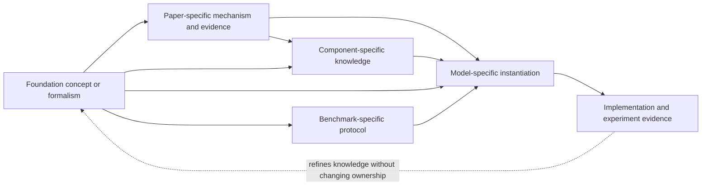

# World Model Foundations

## Retrieval metadata

**Relevant queries:** model-independent definitions, problem formulations, dynamics, representations, predictive objectives, planning, control, embodiment, data, evaluation, or open research questions.

**Knowledge provided:** canonical concepts and decision-relevant principles that transfer across world-model families, together with links to paper evidence and model-specific instantiations.

**Related pages:** [Papers](../papers/README.md) owns paper-specific mechanisms and experiments; [Models](../models/README.md) owns model-specific implementations and execution evidence; [Components](../components/README.md) contains independently scoped component knowledge; [Benchmarks](../benchmarks/README.md) owns versioned evaluation systems.

## Authority boundary

Foundation knowledge can influence Agent understanding, diagnosis, design judgment, and strategy selection. It does not select Agents or repositories, decompose tasks, schedule execution, grant permissions, authorize external actions, or otherwise replace AIBuildAI workflow orchestration. The [retrieval index](retrieval-index.yaml) is an advisory query-to-knowledge map, not a workflow definition.

## Canonical scope

Foundations owns model-independent concepts. A Foundation page explains a reusable definition, formalism, mechanism family, trade-off, or evaluation principle once; Paper entries own evidence reported by individual works, Model entries own concrete architectures, checkpoints, interfaces, results, and execution records, and Benchmark entries own versioned evaluation systems.

These connections are non-exclusive. A task may draw on several Foundation subparts and combine them with Paper, Component, and Model knowledge according to its current information needs.

## Knowledge map

| Subpart | Canonical question | Boundary |
|---|---|---|
| [Definitions and taxonomy](definitions-and-taxonomy/README.md) | What counts as a world model, and how do named families relate? | Terminology and family boundaries, not detailed equations or implementations |
| [Problem formulation](problem-formulation/README.md) | Which variables, distributions, assumptions, and prediction directions define the problem? | Mathematical contracts, not planning algorithms or embodiment-specific interfaces |
| [Representations](representations/README.md) | What information is encoded or predicted, and with which structural priors? | Representation semantics, not the objective used to fit or sample the model |
| [Learning objectives](learning-objectives/README.md) | How are predictive distributions or representations trained and sampled? | Objective and inference families, not dataset recipes or state semantics |
| [Decision-making](decision-making/README.md) | How can learned predictions support planning, control, and policy improvement? | Decision use of a model, not actuator or sensor integration |
| [Embodied systems](embodied-systems/README.md) | How do abstract model contracts meet physical observations, actions, controllers, and deployment constraints? | Embodiment-specific interfaces and risks, not general dynamics notation |
| [Data and evaluation](data-and-evaluation/README.md) | What evidence is needed to learn, compare, and falsify world-model claims? | Model-independent data and measurement principles, not model-specific scores |
| [Research frontiers](research-frontiers/README.md) | Which unresolved conditions could change a modeling or evaluation judgment? | Cross-cutting unknowns, not a task queue or execution schedule |

## Canonical ownership rule

The subparts answer different questions:

`meaning → formal variables → represented information → learning objective → decision use → physical interface → evidence → unresolved conditions`

Adjacent pages may summarize the dependency needed for a local argument, but they link to the canonical owner for the complete explanation. A paper result is not promoted into a general principle without its assumptions and evidence boundary; a model implementation is not presented as a universal definition.

## Provenance and authoring

Model-independent source identities resolve through the part-local `foundations/sources.yaml` registry. Paper- and model-specific identities remain in their owning entries and may be cited across parts by their globally unique IDs; the same source object is not copied into another registry. Prose retains a precise page, section, table, figure, or symbol locator where available.

Use the [Foundation page template](../_schema/foundation-page-template.md) and [writing style](../_schema/style-guide.md) for canonical concept pages. Retrieval metadata describes discoverability and related knowledge without prescribing a reading order or execution policy.
