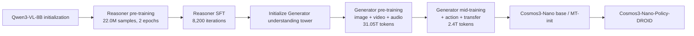

# Cosmos3-Nano Training State and Optimization Levers

## Retrieval metadata

**Relevant queries:** source checkpoint, parameter freezing, training objective, optimizer, stage mixture, sequence construction, distributed system, or checkpoint lifecycle.

**Knowledge provided:** published training state, objectives, curricula, trainable-group semantics, system characteristics, controllable variables, confounders, and candidate intervention patterns.

**Related pages:** [Data](data.md) contains dataset construction; [Post-training](post-training.md) contains public SFT recipes; [Inference](inference.md) contains runtime commands; [Evaluation](evaluation.md) contains benchmark definitions; [Reproduction](reproduction.md) contains execution status.

## 1. Checkpoint lineage is part of the experimental state



Reasoner and Generator use matching transformer-block shapes but separate Mixture-of-Transformers parameter towers. The trained Reasoner initializes the Generator's autoregressive understanding tower; the generation tower is initialized separately. Generator training freezes the Reasoner/understanding tower and updates generation-specific parameters. Consequently, `base Cosmos3-Nano` denotes the mid-trained omnimodal checkpoint, not the standalone Reasoner, Generator-pretrained state, PT-init control, or Policy-DROID specialist. [C3-TR, pp.11–14, 25–30, Figures 5–6 and Table 2]

The technical report describes foundation-scale Reasoner pre-training, Generator pre-training, and mid-training. The fixed public Framework primarily exposes SFT/post-training recipes through `cosmos_framework.scripts.train --sft-toml=<recipe>`, recipe TOML, experiment SKU, and `SFTExperimentConfig`. Generator/action recipes generally convert a Hugging Face base checkpoint to DCP; Nano Reasoner recipes may first merge to VLM safetensors. Training writes resolved configuration, DCP iteration checkpoints, and RNG state; `export_model` produces inference safetensors. [C3-FW-TRAINING]

Do not infer that the 31.05T/2.4T-token foundation curriculum is reproducible merely because a public SFT recipe launches. Route executable recipe details to [post-training.md](post-training.md).

## 2. Reasoner training state

### 2.1 Pre-training

Nano initializes the language model, ViT, and multimodal projector from Qwen3-VL-8B. All three are trainable from the first pre-training step; there is no projector-only alignment stage in the reported curriculum. The objective is next-token prediction over two epochs of the full mixture using a no-replacement sampler. Maximum sequence length is 16K tokens; each sample is capped at 2,048 image tokens or 8,192 video tokens. [C3-TR, p.26]

Square-root-normalized per-token loss weighting prevents long examples from dominating solely by token count. The report attributes stability and downstream benefit to it but provides no isolated numeric ablation; preserve it as a recipe fact, not a quantified independent gain. [C3-TR, p.26]

| Parameter group | Peak learning rate | Schedule and optimizer |
|---|---:|---|
| Language model + projector | `5e-5` | AdamW; 10% linear warmup; cosine decay to `0.1x` peak |
| ViT | `5e-6` | Same schedule |
| Shared | — | betas `(0.9, 0.999)`; weight decay `0.05`; global gradient clip `1.0` |

### 2.2 Supervised fine-tuning

SFT uses importance-aware per-dataset budgets based on importance, quality, and scale. It mixes a high-quality pre-training replay subset at a `1:4` pre-training:SFT budget and adds 800K instruction-following samples to reduce specialization forgetting. Training runs 8,200 iterations with global batch size 512. [C3-TR, pp.26–27]

| Parameter group | Peak learning rate | Schedule and optimizer |
|---|---:|---|
| Language model + projector | `1e-5` | AdamW; 1,000-step linear warmup; cosine decay to `0.1x` peak |
| ViT | `1e-6` | Same schedule |
| Shared | — | betas `(0.9, 0.95)`; weight decay `0.1`; global gradient clip `1.0` |

The report does not disclose Reasoner GPU count, total tokens, wall-clock time, numerical precision, parallel strategy, or a Nano RL stage. Cosmos-Reason1 used Physical-AI SFT followed by GRPO; the valid Cosmos 3 statement is that the report specifies pre-training and SFT but does not disclose carrying GRPO forward. [R1-TR, pp.15, 20; C3-TR, pp.25–27]

## 3. Generator objective and sequence construction

### 3.1 Rectified-flow velocity matching

For clean latent `x0`, Gaussian noise `epsilon`, and noise level `sigma`:

```text
x_sigma = sigma * epsilon + (1 - sigma) * x0
v_target = epsilon - x0
loss = masked_MSE(v_pred, v_target)
```

A shared denoiser predicts velocity for image, video, audio, and action diffusion subsequences. Clean conditional frames in I2V/V2V are conditioning tokens and are excluded from the target loss. Image, audio, and action use logit-normal noise-time sampling; video uses mode sampling. Shift reparameterization biases training toward higher noise. [C3-TR, p.27]

This extends the Cosmos-Predict2.5 flow-matching and clean-prefix lineage, but Cosmos 3 adds audio, action, native transfer controls, and MoT joint attention. Do not assume weight or implementation compatibility with Predict2.5. [P25-TR, pp.6–11; C3-TR, pp.8–13, 27–30]

### 3.2 Resolution, time, and packing state

| Tier | FPS | Frames | Aspect ratios | Eligibility | Pre-train shift | Mid-train shift |
|---|---:|---:|---|---|---:|---:|
| 256p | 10–30 | 5–400 | 16:9, 4:3, 1:1, 3:4, 9:16 | all source resolutions | 1 | 3 |
| 480p | 10–30 | 5–400 | same | native resolution ≥480p | 3 | 5 |
| 720p | 10–30 | 5–300 | same | native resolution ≥720p | 5 | 10 |

Table 5 fixes exact dimensions, including 1280×720 for 720p 16:9 and 960×960 for 720p 1:1. Variable-length samples are packed without padding into a 74,000-token context. The pre-training batch ratio image-only:video-256p:video-480p:video-720p is `1:1:2:1`, equivalent to 20% image and 80% video at the modality level. [C3-TR, pp.27–28, Table 5 and Figure 10]

FPS is encoded both in the structured JSON prompt and by scaling 3D MRoPE temporal coordinates relative to 24 FPS. In the reported ablation, no control/text/MRoPE/both produce composite scores `8.51/9.28/9.63/9.81`, while average DOVER visual quality stays near 12.8–13.0. Interpret the gain as motion-fidelity control, not general visual-quality gain. [C3-TR, pp.107–108, Table 29]

## 4. Generator pre-training state

Four visual task modes share structured captions and differ by clean-prefix length:

| Mode | Total mixture share | Clean condition | Target |
|---|---:|---|---|
| T2I | 20% | One frame treated as `T=1` | Generate an image from text |
| T2V | 56% | `T_cond=0` | Generate full video from text, duration, and FPS |
| I2V | 16% | First latent frame remains clean | Generate a future from an initial image |
| V2V | 8% | First 5 pixel frames / 2 latent frames remain clean | Continue a video |

Figure 10 also expresses the video-only split as 70%/20%/10%; multiplied by the 80% video share, the two representations agree. [C3-TR, pp.28–29, Figure 10]

The Reasoner tower is frozen. Generation-specific parameters use FusedAdamW, learning rate `1e-4`, betas `(0.9, 0.99)`, weight decay `0.05`, global gradient clip `1.0`, warmup, then linear decay to `0.30x` peak. All modalities use 10% text dropout for classifier-free guidance. Nano processes 31.05T tokens on 1,024 GB200 GPUs; Super processes 17.86T tokens on 2,048 GB200 GPUs. These are full training scales, not inference requirements. [C3-TR, p.29]

A controlled 90K-iteration, 256-GPU ablation initializes otherwise-from-scratch Generator towers with either Qwen3-VL-8B or the Cosmos3-Nano Reasoner. The Cosmos Reasoner raises T2V Domain `73.7→75.7`, Robot `66.5→71.3`, and I2V Domain `80.0→80.8`, with essentially unchanged Quality. Use this as evidence for Physical-AI representation transfer, not universal perceptual-quality improvement. [C3-TR, p.107, Table 28]

## 5. Generator mid-training state

Mid-training continues from Generator pre-training, retains the four visual modes, and introduces audio, action, and transfer controls. Its output is base Cosmos3-Nano, also called MT-init in downstream comparisons. [C3-TR, pp.29–30]

| Stream | Share | Modes or controls |
|---|---:|---|
| Image | 10% | T2I |
| Video | 32% | T2V, I2V, V2V |
| Video + audio | 8% | T2(V+A), I2(V+A), V2(V+A) |
| Action | 25% | forward dynamics, inverse dynamics, policy |
| General transfer | 20% | edge, blur, depth, segmentation |
| Driving transfer | 5% | world-scenario-map |

All modalities retain rectified-flow velocity MSE. Action inherits the visual noise schedule. Because normalized action-vector MSE is numerically smaller, its loss is multiplied by 10; this is an objective weight, not mixed-precision loss scaling. Optimization uses FusedAdamW with learning rate `1e-4`, weight decay `0.05`, gradient clip `1.0`, and a LambdaLinear schedule with start factor `0.4` and 100,000-step cycle length. Nano processes 2.4T tokens on 1,024 GB200 GPUs; Super processes 1.9T tokens on 2,048 GB200 GPUs. [C3-TR, p.30, Table 6]

### 5.1 Positive transfer and interference

Compute-matched PT-init versus MT-init comparisons show gains from action-inclusive mid-training for AV inverse dynamics and camera, egocentric, and robotics forward dynamics. [C3-TR, pp.65–67, Table 18]

An Edge-scale PushT + Cosmos3-Edge ablation gives each single task 2K steps and joint FD/ID/policy 6K steps. Joint training lowers ID MSE from `1.11e-3` to `3.09e-4` and raises policy coverage `74.1→77.3%`, but reduces FD PSNR `27.13→26.22`. The result establishes potential sharing and interference, not Nano-DROID magnitudes. [C3-TR, p.109, Table 31]

Pairwise domain matrices are also non-monotonic. Some robot/camera combinations accelerate early adaptation, while others interfere; egocentric warmup improves AgiBot FD PSNR by about `+0.94` to `+1.64` across 5K–30K steps. Search mixtures and leave-one-domain-out conditions instead of assuming that more domains are monotonically better. [C3-TR, pp.70–72, Figures 28–29]

## 6. Training-system state

Wan2.2 causal video VAE performs online tokenization. Because Nano transformer compute does not fully hide VAE latency, encoding chunks vary by resolution: 68 frames at 256p, 24 at 480p, and 12 at 720p. `torch.compile` reduces encode latency by 52%. Three resolutions × five aspect ratios × prime/cache modes create 45 static graphs; AOTInductor distributes compilation across at least 45 ranks, reducing warm-up from about 15 minutes to under one minute. [C3-TR, pp.43–44, Figure 15]

Checkpoint writes overlap training through a separate Gloo process group and cached save plans. Relative to synchronous saves every 30 minutes, Nano end-to-end time falls 4%; reported mean/min/max save times are 72/43/250 seconds. Object-store load uses lowest-rank deduplication, and resume restores per-rank RNG state. [C3-TR, pp.43–45, Table 7]

For the standardized T2I+T2V workload, Nano reports 7.1 seconds/step, 507 iterations/hour, 520 TFLOPS/GPU, MFU 0.23, 4.56M image tokens/GPU-hour, and 16.23M video tokens/GPU-hour. [C3-TR, pp.45–46, Table 8]

The report contains an unresolved hardware-count conflict: p.45 says throughput benchmarking used 1,024/2,048 GB200 GPUs for Nano/Super, while the Table 8 caption says 2,048/4,096. Foundation-stage sections pp.29–30 explicitly state 1,024 GB200 for Nano pre-training and mid-training. Preserve both throughput values; do not choose one by inference. [C3-TR, pp.29–30, 45–46, Table 8]

## 7. Controllable training levers

| Lever | Default reference | Use to test | Critical guardrail |
|---|---|---|---|
| Source checkpoint | PT-init, MT-init, Reasoner, or specialist | Value of action-aware or domain-aware initialization | Same architecture, data, steps, and compute |
| Trainable groups | Reasoner all groups; Generator generation tower | Representation retention versus plasticity | Log parameter names/counts and gradient norms |
| Per-group learning rate | ViT at `0.1x` LM in Reasoner; action modules may use multipliers downstream | Fast interface adaptation | Monitor new-module explosion and backbone drift |
| Replay ratio | Reasoner SFT uses `1:4` pre-training:SFT | Forgetting control | Fixed total tokens and task mixture |
| Modality/task mixture | Mid-training table above | Positive transfer and interference | Per-domain regression matrix |
| Loss weights | Action `10x` in mid-training | Balance numerically unequal objectives | Track raw and weighted losses separately |
| Noise sampler/shift | Modality-specific | High-noise learning and modality balance | Same inference sampler in comparisons |
| Clean-prefix policy | T2V/I2V/V2V definitions | Conditioning fidelity | Masked targets must remain identical |
| Resolution/FPS/frame buckets | Table in §3.2 | Long-horizon and high-resolution capacity | Equalize image/video tokens and compute |
| Structured-caption dropout | 10% in Generator pre-training | CFG robustness | Freeze caption schema and inference CFG |
| Packing/context | 74K Generator; 16K Reasoner | Utilization and long-context behavior | Report effective tokens and truncation |
| Joint versus staged training | Reasoner→Generator→mid-train | Transfer versus interference | Include single-task and frozen-control arms |

## Candidate intervention patterns (not live queue items)

The following entries are reusable hypothesis templates, not active or prioritized experiments. Before execution, instantiate the selected pattern as a stable `RQ-*` item in [research-queue.md](research-queue.md) with explicit state, dependencies, experiment contract, and closure rule.

- **TRAIN-H01 — MT-init sample efficiency:** action-aware MT-init should converge faster than PT-init on a new control domain; compare full learning curves, not only final checkpoints.
- **TRAIN-H02 — Selective unfreezing:** start with new adapters/action modules and expand unfreezing only after a representation bottleneck is demonstrated; use forgetting metrics to gate each expansion.
- **TRAIN-H03 — Gradient-balanced multitask training:** dynamic or normalized objective weighting may preserve ID/policy gains while recovering FD PSNR lost under fixed joint weighting.
- **TRAIN-H04 — Domain-aware curriculum:** warmup on positively transferring domains followed by target-heavy training may outperform uniform all-domain sampling.
- **TRAIN-H05 — Temporal-control factorization:** retain both textual FPS and MRoPE time modulation; ablate them independently before changing temporal data.
- **TRAIN-H06 — Resolution curriculum:** low-resolution/short-sequence adaptation followed by target-resolution consolidation may reduce compute without sacrificing final task performance; final evaluation must use the target resolution and horizon.
- **TRAIN-H07 — Replay for specialization:** general and Physical-AI replay should reduce catastrophic forgetting during narrow-domain SFT; tune replay by Pareto frontier rather than a single aggregate score.
- **TRAIN-H08 — Reasoner-guided Generator adaptation:** preserving the Reasoner-initialized understanding tower should protect Physical-AI semantics; unfreeze only with an explicit domain representation hypothesis.

Only instantiated `RQ-*` records may carry priority, state, dependencies, or closure status in [research-queue.md](research-queue.md); reusable procedures belong in [optimization-playbook.md](optimization-playbook.md).

## 9. Experiment-record fields

A training comparison is easier to interpret when its record preserves:

1. exact source checkpoint hash, code revision, tokenizer/VAE revision, and checkpoint layout;
2. trainable/frozen parameter names, counts, initialization, optimizer group, learning-rate multiplier, and gradient statistics;
3. immutable data manifest, mixture weights, replay ratio, sequence packing, resolution/FPS/frame buckets, and total effective tokens;
4. objective, target masks, noise sampler/shift, raw and weighted per-modality losses, text dropout, and action normalization;
5. optimizer, betas, weight decay, gradient clip, schedule, warmup, global/micro batch, accumulation, iterations, and token budget;
6. precision, parallelism, GPU type/count, VAE chunking, compilation mode, checkpoint interval, wall-clock, and resume RNG state;
7. at least one initialization control and one unchanged baseline; use three or more seeds when variance can change the decision;
8. target capability, general retention, domain regressions, safety metrics, system throughput, and failure taxonomy at predeclared checkpoints;
9. resolved configuration, logs, DCP state, exported checkpoint hash, evaluation artifacts, and termination reason.

For a data-only or optimizer-only claim, hold every non-target factor constant. PT-init versus MT-init must use the same model scale, downstream data, training steps, optimizer, and compute budget.

## 10. Attribution-risk signals

A training claim is weak or invalid when:

- checkpoint identity, tower initialization, or trainable-parameter scope is ambiguous;
- action units, coordinate frames, frequency, target masks, or clean-prefix masks fail invariance tests;
- NaN/Inf, persistent gradient clipping, loss explosion, collapsed variance, or invalid decoded samples appear;
- one objective dominates weighted gradients and task metrics without a predeclared trade-off;
- a target gain requires changed data, prompt rewriting, judge, sampler, or compute in the comparison arm;
- retention or safety guardrails regress beyond their declared thresholds;
- a mixture improvement is aggregate-only and hides a critical domain or embodiment regression;
- throughput optimization changes numerical outputs beyond tolerance;
- repeated checkpoints show no practically meaningful progress relative to compute, or validation degrades while training loss continues to fall;
- resume cannot restore optimizer, scheduler, data position, and per-rank RNG state.

## 11. Canonical routing

- Route raw data, filtering, captions, action normalization, and mixture manifests to [data.md](data.md).
- Route specialist branches, public SFT recipes, checkpoint conversion, resume, and export to [post-training.md](post-training.md).
- Route architecture and tower ownership to [architecture.md](architecture.md).
- Route metrics, baselines, ablations, and comparison validity to [evaluation.md](evaluation.md).
- Route model risk and deployment guardrails to [limitations.md](limitations.md).
- Route experiment prioritization to [research-queue.md](research-queue.md) and procedures to [optimization-playbook.md](optimization-playbook.md).
- Route actual run claims and artifacts to [reproduction.md](reproduction.md).
- Resolve source IDs and fixed revisions in [sources.yaml](sources.yaml).
